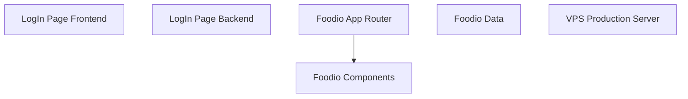

## 1. Stack
- Repo is a "100 Days of Web Development" learning collection of 3 independent mini-projects (README.md).
- LogIn Page: static HTML/CSS frontend + Node.js/Express backend (CommonJS, `require`).
- Restaurant Website/foodio: Next.js 16 (App Router) + React 19 + TypeScript + Tailwind CSS 4 + Framer Motion.
- VPS Production/Server: standalone Node.js/Express server (ESM, `"type": "module"`).
- No shared build tooling between the three projects — each has its own package.json.

## 2. Directory map
| path | what lives there |
|---|---|
| `LogIn Page/` | Static HTML/CSS login form (`index.html`, `style.css`) |
| `LogIn Page/backend/` | Express backend server (`server.js`) |
| `Restaurant Website/` | Foodio Next.js app + reference images (`Imagee/`) + project-local CLAUDE.md/MEMORY.md |
| `Restaurant Website/foodio/` | Next.js 16 App Router project root (`app/`, `components/`, `data/`, `public/`) |
| `VPS Production/` | VPS deployment mini-project |
| `VPS Production/Server/` | Express server for production hosting (`index.js`) |

## 3. Diagram

## 4. Component index
- [[LogIn Page Frontend]]
- [[LogIn Page Backend]]
- [[Foodio App Router]]
- [[Foodio Components]]
- [[Foodio Data]]
- [[VPS Production Server]]

## 5. Entry points
- LogIn Page frontend (dev): open `LogIn Page/index.html` directly in a browser (README.md — no dev server).
- LogIn Page backend (dev/prod): `node backend/server.js` from `LogIn Page/` (README.md; no npm script defined — package.json only has a placeholder `test` script). Listens on port 3001 (server.js).
- Foodio (dev): `npm run dev` from `Restaurant Website/foodio/` → runs `next dev` (foodio/package.json), serves `http://localhost:3000` (README.md). Root entry: `Restaurant Website/foodio/app/layout.tsx` + `app/page.tsx`.
- Foodio (prod): `npm run build` then `npm start` from `Restaurant Website/foodio/` → `next build` / `next start` (foodio/package.json).
- VPS Production Server (start): `npm start` from `VPS Production/Server/` → `node index.js` (Server/package.json). Listens on `process.env.PORT` (index.js) — TODO: verify (`.env` out of scope).

## 6. Conventions
- LogIn Page backend uses CommonJS (`require(...)`, no `"type"` field in package.json) — server.js.
- VPS Production/Server uses ES modules (`import ...`, `"type": "module"` in package.json) — index.js.
- Both Express servers (LogIn Page backend, VPS Production Server) follow the same shape: `cors()` + `express.json()` middleware, then a `GET /` health-check route returning a plain string — observed identically in both server.js and index.js.
- Foodio imports use the `@/` path alias (e.g. `@/components/Navbar`, `@/components/CartContext`) — observed in app/page.tsx and app/layout.tsx.
- Foodio root layout (`app/layout.tsx`) loads Google fonts via `next/font/google` (Playfair Display, Inter) and wraps `children` in `CartProvider` from `@/components/CartContext`.

## 7. Where things go
- New Foodio page/route → new folder under `Restaurant Website/foodio/app/` with its own `page.tsx` (App Router convention observed: `app/page.tsx`, plus existing `food-menu/`, `admin/`, `my-orders/`, `sign-in/` route folders).
- New Foodio UI piece → add a `.tsx` file to `Restaurant Website/foodio/components/` and import it via the `@/components/...` alias (pattern observed in app/page.tsx, app/layout.tsx).
- New LogIn Page backend route → edit `LogIn Page/backend/server.js` (Express `app.get`/`app.use` pattern already there).
- New VPS Production route → edit `VPS Production/Server/index.js` (Express `app.get` pattern already there, e.g. the `/login` route).
- LogIn Page frontend styling change → edit `LogIn Page/style.css` (linked from `index.html`).
