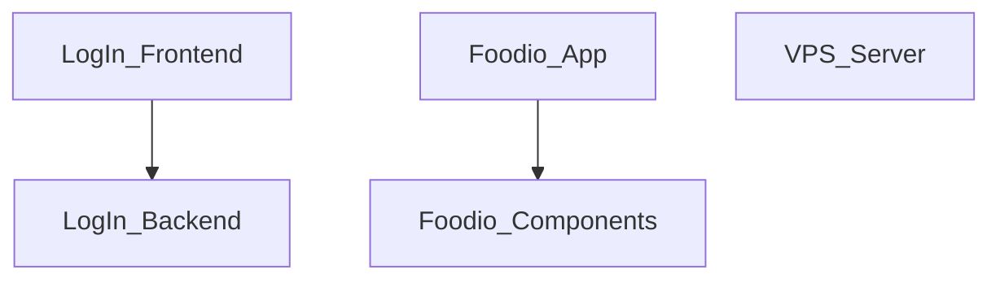

## Stack
Multi-project learning monorepo, no shared root manifest. Three independent sub-projects:
- `LogIn Page/`: static HTML/CSS frontend + Node.js/Express backend (package.json).
- `Restaurant Website/foodio/`: Next.js 16 (App Router) + React 19 + TypeScript + Tailwind CSS 4 + framer-motion.
- `VPS Production/Server/`: Node.js/Express server (ESM, `"type": "module"`).

## Directory map
| path | what lives there |
|---|---|
| `LogIn Page/` | static login frontend (`index.html`, `style.css`) |
| `LogIn Page/backend/` | Express backend server (`server.js`) |
| `Restaurant Website/foodio/` | Next.js restaurant web app root |
| `Restaurant Website/foodio/app/` | App Router routes: `page.tsx`, `layout.tsx`, `food-menu/`, `admin/`, `my-orders/`, `sign-in/` |
| `Restaurant Website/foodio/components/` | React UI components incl. `admin/` subfolder |
| `Restaurant Website/foodio/public/`, `Restaurant Website/foodio/data/` | static assets and data files |
| `Restaurant Website/Imagee/` | image assets for the restaurant site (marketing/README use) |
| `VPS Production/Server/` | standalone Express server (`index.js`) for VPS deployment |
| `README.md` | repo-level description of the 100-day learning plan |

## Diagram

## Component index
- [[LogIn_Frontend]]
- [[LogIn_Backend]]
- [[Foodio_App]]
- [[Foodio_Components]]
- [[VPS_Server]]

## Entry points
- LogIn Page dev/prod: open `LogIn Page/index.html` in browser; backend via `node backend/server.js` (per README) — file at `LogIn Page/backend/server.js`, listens on port 3001.
- Foodio dev: `next dev` (from `Restaurant Website/foodio/package.json` scripts), entry `Restaurant Website/foodio/app/page.tsx` / `Restaurant Website/foodio/app/layout.tsx`. Prod: `next build` then `next start`.
- VPS Production dev/prod: `node index.js` (script `start`) at `VPS Production/Server/index.js`, listens on `process.env.PORT`.

## Conventions
- LogIn Page backend uses CommonJS (`require`), VPS Production server uses ESM (`import`, `"type": "module"` in its package.json) — observed directly in each file.
- Foodio app uses Next.js App Router file convention: each route is a folder under `app/` with a `page.tsx` (e.g. `app/food-menu/page.tsx`, `app/sign-in/page.tsx`), and `app/admin/` has its own `layout.tsx`.
- Foodio components live flat in `components/`, except admin-specific ones grouped under `components/admin/`.

## Where things go
- To add a new LogIn Page frontend field/behavior: edit `LogIn Page/index.html` and `LogIn Page/style.css`.
- To add a new LogIn Page backend route: edit `LogIn Page/backend/server.js`.
- To add a new Foodio page/route: add a folder with `page.tsx` under `Restaurant Website/foodio/app/`.
- To add a new Foodio UI piece: add a component to `Restaurant Website/foodio/components/` (or `components/admin/` for admin-only UI).
- To add a new VPS Production API route: edit `VPS Production/Server/index.js`.
